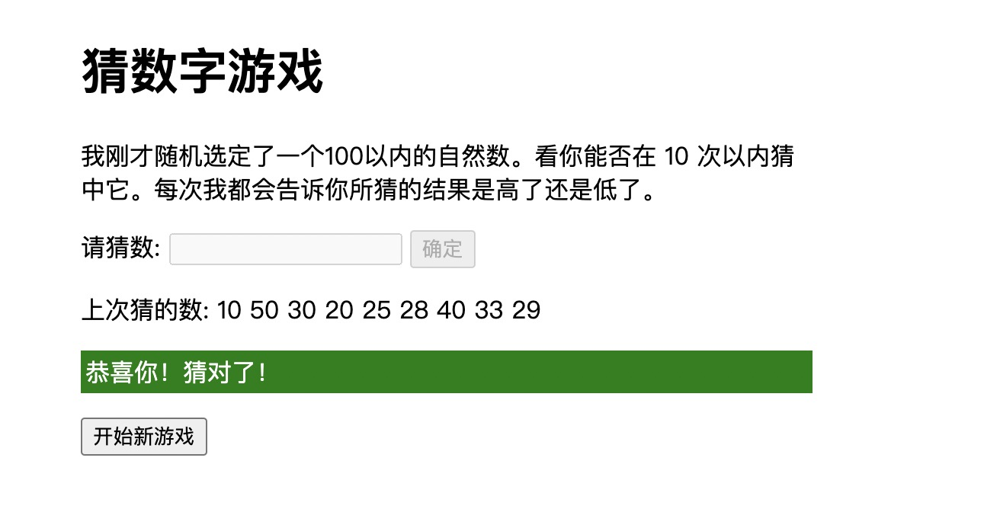

# JavaScript 入门

:::tip 问题列表

- 什么是 JavaScript？
- JavaScript 能做什么？
- JavaScript 在页面上做了什么？
- async 和 defer 有什么用，区别是什么？
- JavaScript 变量是什么？
- 变量命名规则？
- JavaScript 中有哪些运算符？
- 什么是字符串？
- 什么是数组？

:::

## [什么是 JavaScript](https://developer.mozilla.org/zh-CN/docs/Learn/JavaScript/First_steps/What_is_JavaScript)

JavaScript 是一种脚本，一门编程语言，它可以在网页上实现复杂的功能，网页展现给你的不再是简单的静态信息，而是实时的内容更新，交互式的地图，2D/3D 动画，滚动播放的视频等等。

## JavaScript 可以做什么？

浏览器 API 内建于 web 浏览器中，可以做实用的复杂工作。例如：

- [文档对象模型 API（DOM（Document Object Model）API）](https://developer.mozilla.org/zh-CN/docs/Web/API/Document_Object_Model) 能通过创建、移除和修改 HTML，为页面动态应用新样式等手段来操作 HTML 和 CSS。比如当某个页面出现了一个弹窗，或者显示了一些新内容（像上文小 demo 中看到那样），这就是 DOM 在运行。

- [地理位置 API（Geolocation API）](https://developer.mozilla.org/zh-CN/docs/Web/API/Geolocation) 获取地理信息。这就是为什么 谷歌地图 可以找到你的位置，而且标示在地图上

- [画布（Canvas）](https://developer.mozilla.org/zh-CN/docs/Web/API/Canvas_API) 和 [WebGL API](https://developer.mozilla.org/zh-CN/docs/Web/API/WebGL_API) 可以创建生动的 2D 和 3D 图像。人们正运用这些 web 技术制作令人惊叹的作品。参见 [Chrome Experiments](https://www.chromeexperiments.com/webgl) 以及 [webglsamples](http://webglsamples.org/)

- 诸如 [HTMLMediaElement](https://developer.mozilla.org/zh-CN/docs/Web/API/HTMLMediaElement) 和 [WebRTC](https://developer.mozilla.org/zh-CN/docs/Web/API/WebRTC_API) 等 [影音类 API](https://developer.mozilla.org/en-US/Apps/Fundamentals/Audio_and_video_delivery) 让你可以利用多媒体做一些非常有趣的事，比如在网页中直接播放音乐和影片，或用自己的网络摄像头获取录像，然后在其他人的电脑上展示（试用简易版 截图 demo 以理解这个概念）。

## JavaScript 在页面上做了什么？

浏览器在读取一个网页时，代码（HTML, CSS 和 JavaScript）将在一个运行环境（浏览器标签页）中得到执行。就像一间工厂，将原材料（代码）加工为一件产品（网页）。

在 HTML 和 CSS 集合组装成一个网页后，浏览器的 JavaScript 引擎将执行 JavaScript 代码。这保证了当 JavaScript 开始运行之前，网页的结构和样式已经就位。如果 JavaScript 在 HTML 和 CSS 就位之前加载运行，就会引发错误。

## 浏览器安全

每个浏览器标签页就是其自身用来运行代码的独立容器（这些容器用专业术语称为“运行环境”）。大多数情况下，每个标签页中的代码完全独立运行，而且一个标签页中的代码不能直接影响另一个标签页（或者另一个网站）中的代码。这是一个好的安全措施，如果不这样，黑客就可以从其他网站盗取信息，等等。

> 注：以安全的方式在不同网站/标签页中传送代码和数据的方法是存在的，但这些技术较为高级，本课程不会涉及。

## JavaScript 运行次序

当浏览器执行到一段 JavaScript 代码时，通常会按从上往下的顺序执行这段代码。这意味着你需要注意代码书写的顺序。比如，我们回到第一个例子中的 JavaScript 代码：

```js
const para = document.querySelector("p");

para.addEventListener("click", updateName);

function updateName() {
  let name = prompt("输入一个新的名字：");
  para.textContent = "玩家1：" + name;
}
```

## 解释代码 vs 编译代码

作为程序员，你或许听说过这两个术语：解释（interpret）和 编译(compile)。在解释型语言中，代码自上而下运行，且实时返回运行结果。代码在由浏览器执行前，不需要将其转化为其他形式。代码将直接以文本格式（text form）被接收和处理。

相对的，编译型语言需要先将代码转化（编译）成另一种形式才能运行。比如 C/C++ 先被编译成汇编语言，然后才能由计算机运行。程序将以二进制的格式运行，这些二进制内容是由程序源代码产生的。

JavaScript 是轻量级解释型语言。浏览器接受到 JavaScript 代码，并以代码自身的文本格式运行它。技术上，几乎所有 JavaScript 转换器都运用了一种叫做即时编译（just-in-time compiling）的技术；当 JavaScript 源代码被执行时，它会被编译成二进制的格式，使代码运行速度更快。尽管如此，JavaScript 仍然是一门解释型语言，因为编译过程发生在代码运行中，而非之前。

## 服务器端代码 vs 客户端代码

你或许还听说过服务器端（server-side）和 客户端（client-side）代码这两个术语，尤其是在 web 开发时。客户端代码是在用户的电脑上运行的代码，在浏览一个网页时，它的客户端代码就会被下载，然后由浏览器来运行并展示。这就是客户端 JavaScript。

而服务器端代码在服务器上运行，接着运行结果才由浏览器下载并展示出来。流行的服务器端 web 语言包括：PHP、Python、Ruby、ASP.NET 以及...... JavaScript！JavaScript 也可用作服务器端语言，比如现在流行的 `Node.js` 环境

## 动态代码 vs 静态代码

“动态”一词既适用于客户端 JavaScript，又适用于描述服务器端语言。是指通过按需生成新内容来更新 web 页面 / 应用，使得不同环境下显示不同内容。服务器端代码会在服务器上动态生成新内容，例如从数据库中提取信息。而客户端 JavaScript 则在用户端浏览器中动态生成新内容，比如说创建一个新的 HTML 表格，用从服务器请求到的数据填充，然后在网页中向用户展示这个表格。两种情况的意义略有不同，但又有所关联，且两者（服务器端和客户端）经常协同作战。

没有动态更新内容的网页叫做“静态”页面，所显示的内容不会改变。

## 怎样向页面添加 JavaScript？

可以像添加 CSS 那样将 JavaScript 添加到 HTML 页面中。CSS 使用 `<link>` 元素链接外部样式表，使用 `<style>`元素向 HTML 嵌入内部样式表，JavaScript 这里只需一个元素—— [`<script>`](https://developer.mozilla.org/zh-CN/docs/Web/HTML/Element/script)

## 脚本调用策略

要让脚本调用的时机符合预期，需要解决一系列的问题。这里看似简单，实际大有文章。最常见的问题就是：HTML 元素是按其在页面中出现的次序调用的，如果用 JavaScript 来管理页面上的元素（更精确的说法是使用 文档对象模型 DOM），若 JavaScript 加载于欲操作的 HTML 元素之前，则代码将出错。

```js
document.addEventListener("DOMContentLoaded", function() {
  //   . . .
});
```

这是一个事件监听器，它监听浏览器的 "DOMContentLoaded" 事件，即 HTML 文档体加载、解释完毕事件。事件触发时将调用 " . . ." 处的代码，从而避免了错误发生（[事件](https://developer.mozilla.org/zh-CN/docs/Learn/JavaScript/Building_blocks/Events) 的概念稍后学习）。

“外部”示例中使用了 JavaScript 的一项现代技术（async “异步”属性）来解决这一问题，它告知浏览器在遇到 `<script>` 元素时不要中断后续 HTML 内容的加载。

### async 和 defer

- 如果脚本无需等待页面解析，且无依赖独立运行，那么应使用 async。
- 如果脚本需要等待页面解析，且依赖于其它脚本，调用这些脚本时应使用 defer，将关联的脚本按所需顺序置于 HTML 中。

更多建议阅读 [这里](https://developer.mozilla.org/zh-CN/docs/Learn/JavaScript/First_steps/What_is_JavaScript#%E8%84%9A%E6%9C%AC%E8%B0%83%E7%94%A8%E7%AD%96%E7%95%A5)

## 注释

就像 HTML 和 CSS，JavaScript 代码中也可以添加注释，浏览器会忽略它们，注释只是为你的同事（还有你，如果半年后再看自己写的代码你会说，这是什么垃圾玩意。）提供关于代码如何工作的指引。注释非常有用，而且应该经常使用，尤其在大型应用中。注释分为两类：

- 在双斜杠后添加单行注释，比如：

  ```js
  // 我是一条注释
  ```

- 在 /_ 和 _/ 之间添加多行注释，比如：

  ```js
  /*
  我也是
  一条注释
  */
  ```

## [完成猜数字游戏](https://developer.mozilla.org/zh-CN/docs/Learn/JavaScript/First_steps/A_first_splash)

开发一个猜数字游戏。游戏应随机选择一个 100 以内的自然数, 然后邀请玩家在 10 轮以内猜出这个数字。每轮后都应告知玩家的答案正确与否，如果出错了，则告诉他数字是低了还是高了。并且应显示出玩家前一轮所猜的数字。一旦玩家猜对，或者用尽所有机会，游戏将结束。游戏结束后，可以让玩家选择再次开始。



## [查找并解决 JavaScript 代码的错误](https://developer.mozilla.org/zh-CN/docs/Learn/JavaScript/First_steps/What_went_wrong)

一般来说，代码错误主要分为两种：

- 语法错误：代码中存在拼写错误，将导致程序完全或部分不能运行，通常你会收到一些出错信息。只要熟悉语言并了解出错信息的含义，你就能够顺利修复它们。

- 逻辑错误：有些代码语法虽正确，但执行结果和预期相悖，这里便存在着逻辑错误。这意味着程序虽能运行，但会给出错误的结果。由于一般你不会收到来自这些错误的提示，它们通常比语法错误更难修复。

## 变量是什么?

一个变量，就是一个用于存放数值的容器。这个数值可能是一个用于累加计算的数字，或者是一个句子中的字符串。变量的独特之处在于它存放的数值是可以改变的。让我们看一个简单的例子:

```html
<button>Press me</button>
```

```js
const button = document.querySelector("button");

button.onclick = function() {
  let name = prompt("What is your name?");
  alert("Hello " + name + ", nice to see you!");
};
```

变量的另一个特性就是它们能够存储任何的东西 -- 不只是字符串和数字。变量可以存储更复杂的数据，甚至是函数。我们说，变量是用来存储数值的，那么有一个重要的概念需要区分。变量不是数值本身，它们仅仅是一个用于存储数值的容器。你可以把变量想象成一个个用来装东西的纸箱子。

### 声明变量

要想使用变量，你需要做的第一步就是创建它 -- 更准确的说，是声明一个变量。声明一个变量的语法是在 var 或 let 关键字之后加上这个变量的名字：

```js
let myName;
let myAge;
```

### 初始化变量

一旦你定义了一个变量，你就能够初始化它. 方法如下，在变量名之后跟上一个“=”，然后是数值:

```js
myName = "Chris";
myAge = 37;
```

### 更新变量

一旦变量赋值，您可以通过简单地给它一个不同的值来更新它。试试在你的控制台中输入下面几行:

```js
myName = "Bob";
myAge = 40;
```

### 关于变量命名的规则

你可以给你的变量赋任何你喜欢的名字，但有一些限制。 一般你应当坚持使用拉丁字符(0-9,a-z,A-Z)和下划线字符。

- 你不应当使用规则之外的其他字符，因为它们可能引发错误，或对国际用户来说难以理解。

- 变量名不要以下划线开头—— 以下划线开头的被某些 JavaScript 设计为特殊的含义，因此可能让人迷惑。

- 变量名不要以数字开头。这种行为是不被允许的，并且将引发一个错误。

- 一个可靠的命名约定叫做 "小写驼峰命名法"，用来将多个单词组在一起，小写整个命名的第一个字母然后大写剩下单词的首字符。我们已经在文章中使用了这种命名方法。

- 让变量名直观，它们描述了所包含的数据。不要只使用单一的字母/数字，或者长句。

- 变量名大小写敏感——因此 myage 与 myAge 是 2 个不同的变量。

- 最后也是最重要的一点—— 你应当避免使用 JavaScript 的保留字给变量命名。保留字，即是组成 JavaScript 的实际语法的单词！因此诸如 var, function, let 和 for 等，都不能被作为变量名使用。浏览器将把它们识别为不同的代码项，因此你将得到错误。

### 变量类型

- Number
- String
- Boolean
- Array
- Object

## 动态类型

JavaScript 是一种“动态类型语言”，这意味着不同于其他一些语言(译者注：如 C、JAVA)，您不需要指定变量将包含什么数据类型（例如 number 或 string）

## [JavaScript 中的基础数学 — 数字和操作符](https://developer.mozilla.org/zh-CN/docs/Learn/JavaScript/First_steps/Math)

> 以下内容了解即可

数字类型

不同的术语来描述不同类型的十进制数，例如：

- 整数 就是整数,例如 10, 400, 或者 -5.
- 浮点数 (浮点) 有小数点或小数位，例如 12.5，和 56.7786543。
- 双精度双精度是一种特定类型的浮点数，它们具有比标准浮点数更高的精度（这意味着它们精确到更大的小数位数）。

不同类型的数字系统

- 二进制 — 计算机的最基础语言; 0s and 1s
- 八进制 — 基数 8，每列使用 0-7
- 十六进制 — 基数 16，每列使用 0-9，然后使用 a-f。 在 CSS 中设置颜色时，可能会遇到这些数字。

## 运算符

以下内容建议都要了解一下：

- 算术运算符
- 运算符优先级
- 自增和自减运算符
- 赋值运算符
- 比较运算符

[参阅本章](https://developer.mozilla.org/zh-CN/docs/Learn/JavaScript/First_steps/Math#%E7%AE%97%E6%9C%AF%E8%BF%90%E7%AE%97%E7%AC%A6)

## JavaScript 中的字符串

Web 是一种主要基于文本的媒介，旨在让人们进行交流和分享信息，因此对我们来说，掌握它所出现的单词是很有用的。HTML 为我们的文本提供了结构和意义， CSS 允许我们精确地设计它的样式，JavaScript 包含许多操作字符串的特性，创建定制的欢迎消息，在需要时显示正确的文本标签，将术语排序到所需的顺序，等等。

### 创建一个字符串

```js
let string = "The revolution will not be televised.";
string;
```

### 单引号和双引号

在 JavaScript 中，您可以选择单引号或双引号来包裹字符串。两者之间几乎没有什么区别，根据个人偏好来使用。

```js
let sgl = "Single quotes.";
let dbl = "Double quotes";
sgl;
dbl;
```

### 转义字符串中的字符

[转义字符](https://developer.mozilla.org/zh-CN/docs/Web/JavaScript/Reference/Global_Objects/String#Parameters)

### 连接字符串

连接是一个很花哨的编程词，意思是“连接在一起”。在 JavaScript 中连接字符串使用加号(+)操作符，我们也用它来将数字加在一起，但是在这种情况下，它做了一些不同的事情。

```js
let one = "Hello, ";
let two = "how are you?";
let joined = one + two;
joined;
```

我们只是把两个字符串连接在一起，但是你可以喜欢连接多少就多少个， 只需要在它们之间加上 + 操作符。还能用真实的字符串和变量来混合

```js
let response = one + "I am fine — " + two;
response;
```

### 数字与字符

考虑下面这段代码：

```js
"Front " + 242;
```

您可能会认为这会抛出一个错误，但它运行得很好。
试图将字符串表示为一个数字并不是很讲的通，但是用数字表示一个字符串则不然，因此浏览器很聪明地将数字转换为字符串，并将这两个字符串连接在一起。

## [数组](https://developer.mozilla.org/zh-CN/docs/Learn/JavaScript/First_steps/Arrays)

数组是一个包含了多个值的对象。数组对象可以存储在变量中，并且能用和其他任何类型的值完全相同的方式处理，区别在于我们可以单独访问列表中的每个值，并使用列表执行一些有用和高效的操作，如循环 - 它对数组中的每个元素都执行相同的操作。

### 创建数组

数组由方括号构成，其中包含用逗号分隔的元素列表。

假设我们想在一个数组中存储一个购物清单 - 我们会做一些像下面这样的事情：

```js
let shopping = ["bread", "milk", "cheese", "hummus", "noodles"];
shopping;
```

建议跟着 MDN 中，[数组](https://developer.mozilla.org/zh-CN/docs/Learn/JavaScript/First_steps/Arrays) 这章认真学习一遍。

### 练习

- [笑话生成器](https://developer.mozilla.org/zh-CN/docs/Learn/JavaScript/First_steps/Silly_story_generator)

## [条件语句](https://developer.mozilla.org/zh-CN/docs/Learn/JavaScript/Building_blocks/conditionals)

- if ... else 语句

  ```js
  // 伪代码
  if (condition) {
    code to run if condition is true
  } else {
    run some other code instead
  }
  ```

- switch 语句

  ```js
  switch (expression) {
  case choice1:
    run this code
    break;

  case choice2:
    run this code instead
    break;

  // include as many cases as you like

  default:
    actually, just run this code
  }
  ```

- 比较运算符

  - `===` 和 `!==` — 判断一个值是否严格等于，或不等于另一个。
  - `<` 和 `>` — 判断一个值是否小于，或大于另一个。
  - `<=` 和 `>=` — 判断一个值是否小于或等于，或者大于或等于另一个。

- 逻辑运算符：&& , || 和 !

  - `&&` — 逻辑与; 使得并列两个或者更多的表达式成为可能，只有当这些表达式每一个都返回 `true` 时，整个表达式才会返回 `true`.
  - `||` — 逻辑或; 当两个或者更多表达式当中的任何一个返回 `true` 则整个表达式将会返回 `true`.
  - `!` — 逻辑非; 对一个布尔值取反, 非 `true` 返回 `false`,非 `false` 返回 `true`.

- 三元运算符

  ```js
  // 伪代码
  ( condition ) ? run this code : run this code instead
  ```

## [循环语句](https://developer.mozilla.org/zh-CN/docs/Learn/JavaScript/Building_blocks/Looping_code)

编程中的循环也是一直重复着去做一件事 - 此处循环便是编程中的术语。

一段循环通常需要一个或多个条件：

- 一个开始条件，它被初始化为一个特定的值 - 这是循环的起点。
- 一个结束条件，这是循环停止的标准 - 通常计数器达到一定值。以上所说的“我有足够的食物”吗？ 假设他需要 10 份食物来养活他的家人。
- 一个迭代器，这通常在每个连续循环上递增少量的计数器，直到达到退出条件。 我们以前没有明确说明，但是我们可以考虑一下农民能够每小时收集 2 份食物。 每小时后，他收集的食物量增加了两倍，他检查他是否有足够的食物。 如果他已经达到 10 分（退出条件），他可以停止收集回家。

```js
// 伪代码
loop(food = 0; foodNeeded = 10) {
  if (food = foodNeeded) {
    exit loop;
    // 我们有足够的食物了，回家吧。
  } else {
    food += 2; // 花一个小时多收集两个食物。
    // 循环将会继续执行。
  }
}
```

JavaScript 中提供了这些循环语句：

- [for 语句](https://developer.mozilla.org/zh-CN/docs/Web/JavaScript/Guide/Loops_and_iteration#for_%E8%AF%AD%E5%8F%A5)
- [do...while 语句](https://developer.mozilla.org/zh-CN/docs/Web/JavaScript/Guide/Loops_and_iteration#do...while_%E8%AF%AD%E5%8F%A5)
- [while 语句](https://developer.mozilla.org/zh-CN/docs/Web/JavaScript/Guide/Loops_and_iteration#while_%E8%AF%AD%E5%8F%A5)
- [labeled 语句](https://developer.mozilla.org/zh-CN/docs/Web/JavaScript/Guide/Loops_and_iteration#labeled_%E8%AF%AD%E5%8F%A5)
- [break 语句](https://developer.mozilla.org/zh-CN/docs/Web/JavaScript/Guide/Loops_and_iteration#break_%E8%AF%AD%E5%8F%A5)
- [continue 语句](https://developer.mozilla.org/zh-CN/docs/Web/JavaScript/Guide/Loops_and_iteration#continue_%E8%AF%AD%E5%8F%A5)
- [for...in 语句](https://developer.mozilla.org/zh-CN/docs/Web/JavaScript/Guide/Loops_and_iteration#for...in_%E8%AF%AD%E5%8F%A5)
- [for...of 语句](https://developer.mozilla.org/zh-CN/docs/Web/JavaScript/Guide/Loops_and_iteration#for...of_%E8%AF%AD%E5%8F%A5)

### 应该使用哪种循环类型？

对于基本用途，for，while 和 do ... while 循环大部分可互换。 他们都可以用来解决相同的问题，你使用哪一个将在很大程度上取决于你的个人偏好 - 哪一个你最容易记住或最直观的。我们建议使用 for，因为它可能是最简单地帮你记住一切 - 初始化程序，退出条件和最终表达式都必须整齐地放入括号，所以很容易看到他们在哪里并检查你没有丢失他们

## 函数

JavaScript 函数用 `function` 关键字定义，后面跟着函数名和圆括号。

一个函数定义（也称为函数声明，或函数语句）由一系列的 `function` 关键字组成，依次为：

- 函数的名称。
- 函数参数列表，包围在括号中并由逗号分隔。
- 定义函数的 JavaScript 语句，用大括号 `{}` 括起来。

```js
function square(number) {
  return number * number;
}
```

## [表达式与运算符](https://developer.mozilla.org/zh-CN/docs/Web/JavaScript/Guide/Expressions_and_Operators)

JavaScript 拥有二元和一元运算符， 和一个特殊的三元运算符（条件运算符）。一个二元运算符需要两个操作数，分别在运算符的前面和后面：

```
操作数1 运算符 操作数2
```

例如, 3+4 或 x\*y。

一个一元运算符需要一个操作数，在运算符前面或后面：

```
运算符 操作数
```

或

```
操作数 运算符
```

例如, x++ 或 ++x。

## 推荐阅读

- [跨浏览器测试](https://developer.mozilla.org/zh-CN/docs/Learn/Tools_and_testing/Cross_browser_testing)
- [客户端 Web API](https://developer.mozilla.org/zh-CN/docs/Learn/JavaScript/Client-side_web_APIs)
- [JavaScript 参考](https://developer.mozilla.org/zh-CN/docs/Web/JavaScript/Reference)
- [JavaScript 错误参考](https://developer.mozilla.org/zh-CN/docs/Web/JavaScript/Reference/Errors)
- [什么是浏览器开发者工具？](https://developer.mozilla.org/zh-CN/docs/Learn/Discover_browser_developer_tools)
- [var 描述](https://developer.mozilla.org/zh-CN/docs/Web/JavaScript/Reference/Statements/var)
- [词法文法](https://developer.mozilla.org/zh-CN/docs/Web/JavaScript/Reference/Lexical_grammar)
- [JavaScript 函数详细参考文档](https://developer.mozilla.org/en-US/docs/Web/JavaScript/Reference/Functions)
- [表达式和运算符](https://developer.mozilla.org/zh-CN/docs/Web/JavaScript/Reference/Operators)
- [数字和日期](https://developer.mozilla.org/zh-CN/docs/Web/JavaScript/Guide/Numbers_and_dates)
- [字符串与文本内容](https://developer.mozilla.org/zh-CN/docs/Web/JavaScript/Guide/Text_formatting)
- [正则表达式](https://developer.mozilla.org/zh-CN/docs/Web/JavaScript/Guide/Regular_Expressions)
- [索引集合类 (Indexed collections)](https://developer.mozilla.org/zh-CN/docs/Web/JavaScript/Guide/Indexed_collections)
- [带键的集合](https://developer.mozilla.org/zh-CN/docs/Web/JavaScript/Guide/Keyed_Collections)
- [使用对象](https://developer.mozilla.org/zh-CN/docs/Web/JavaScript/Guide/Working_with_Objects)
- [继承与原型链](https://developer.mozilla.org/zh-CN/docs/Web/JavaScript/Guide/Working_with_Objects)
- [使用 Promise](https://developer.mozilla.org/zh-CN/docs/Web/JavaScript/Guide/Using_promises)
- [迭代器和生成器](https://developer.mozilla.org/zh-CN/docs/Web/JavaScript/Guide/Iterators_and_Generators)
- [元编程](https://developer.mozilla.org/zh-CN/docs/Web/JavaScript/Guide/Meta_programming)
- [JavaScript modules 模块](https://developer.mozilla.org/zh-CN/docs/Web/JavaScript/Guide/Modules)
